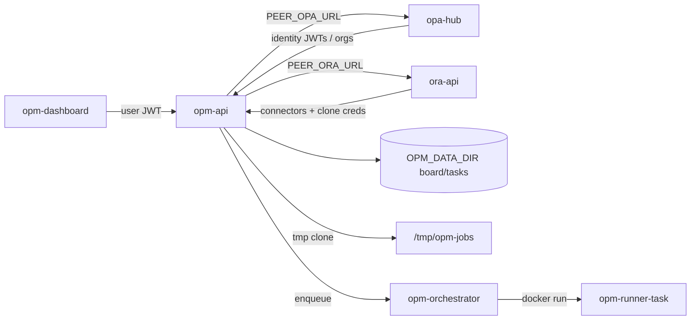

# Architecture

## Components

| Component | Image / binary | Role |
|-----------|----------------|------|
| `opm-api` | `opm-api` | HTTP control plane: GitHub-linked projects, board, tasks, roadmap, ideation, jobs |
| `opm-orchestrator` | same binary, `orchestrator` command | Job lifecycle / reaper stub; spawns one runner container per job |
| `opm-runner-task` | ephemeral | Task-automation sandbox (one container per run phase) |
| `opm-dashboard` | separate repo | Web dashboard (Vite SPA + nginx) — browser only; talks only to `opm-api` |



## Projects = GitHub repositories

An OPM **project** is a linked GitHub repo (`owner/repo`), discovered via:

1. **OPA-Hub** — user identity (co-deployed JWTs) and organization directory (`/api/tenancy/organizations`)
2. **ORA** — GitHub App installations and PATs (connectors); `GET /api/connectors` / `…/repos`

OPM stores **references** (`connectorId`, `ownerRepo`, `organizationId`) only. It never stores GitHub App private keys or PATs.

There is **no** “add local folder” flow and no durable project root under `~/.config/opm/projects/...` as a clone. Job execution uses an **ephemeral tmp clone**, then cleans up.

## Data layout

**Linked-project registry**: `$OPM_DATA_DIR/projects.json`

**Per-project board/task state** (server data dir, keyed by project id):

```text
$OPM_DATA_DIR/projects/<projectId>/
  board.json
  status.json
  changelog.md
  specs/<specId>/task.json
  specs/<specId>/implementation_plan.json
  specs/<specId>/progress.json
  specs/<specId>/spec.md
  roadmap/roadmap.json
  ideation/ideation.json
  runs/<runId>.json
```

Specs may also be committed in-repo later; OPM board state remains keyed by `owner/repo` + task id in the API store.

**Job workspaces**: `$OPM_JOB_TMP/<runId>/repo` (default `/tmp/opm-jobs/...`) — created for a run, removed afterward.

## Kanban columns

Ordered: `backlog` → `queue` → `in_progress` → `review` → `human_review` → `done`.

`review` is the automated review-runner column. Human approval lives in `human_review`.

## Boundary vs ORA / Hub

| Product | Owns |
|---------|------|
| **OPA-Hub** | User JWTs, agent registry, organization directory |
| **ORA** | Repo Watch, SCM connectors (GitHub App/PAT), code review, clone credentials |
| **OPM** | Kanban, roadmaps, ideation, task specs/plans, task-automation jobs |

Dashboards never call a foreign API directly. Cross-product calls use `PEER_*_URL` + service JWTs.
