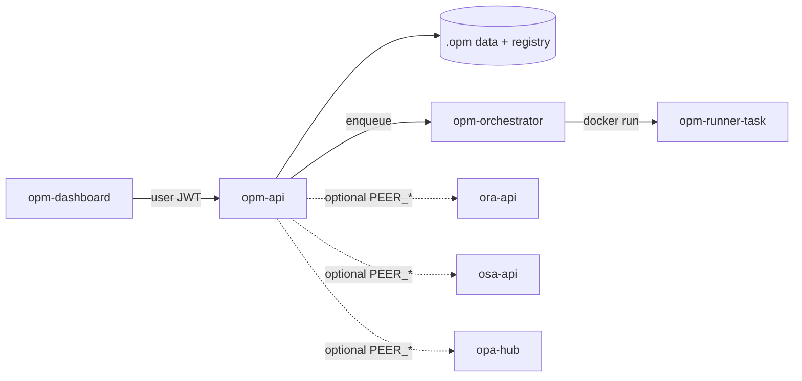

# Architecture

## Components

| Component | Image / binary | Role |
|-----------|----------------|------|
| `opm-api` | `opm-api` | HTTP control plane: projects, board, tasks, roadmap, ideation, jobs |
| `opm-orchestrator` | same binary, `orchestrator` command | Job lifecycle / reaper stub; spawns one runner container per job |
| `opm-runner-task` | ephemeral | Task-automation sandbox (one container per run phase) |
| `opm-dashboard` | separate repo | Web dashboard (Vite SPA + nginx) — browser only; talks only to `opm-api` |



## Data layout

**Registry** (server-local): `$OPM_DATA_DIR/projects.json` (default `~/.config/opm/projects.json`).

**Per project** (under the registered workspace path):

```text
<project>/.opm/
  board.json
  status.json
  changelog.md
  specs/<specId>/task.json
  specs/<specId>/implementation_plan.json
  specs/<specId>/progress.json
  specs/<specId>/spec.md
  roadmap/roadmap.json
  ideation/ideation.json
  runs/<runId>.json
```

## Kanban columns

Ordered: `backlog` → `queue` → `in_progress` → `review` → `human_review` → `done`.

`review` is the automated review-runner column. Human approval lives in `human_review`.

## Boundary vs ORA

- **OPM**: projects, kanban, roadmaps, ideation, task specs/plans, multi-project registry, task-automation jobs
- **ORA**: Repo Watch, SCM connectors, automated code review, review check-runs

Cross-product deep-links use peer URLs; dashboards never call a foreign API directly.
