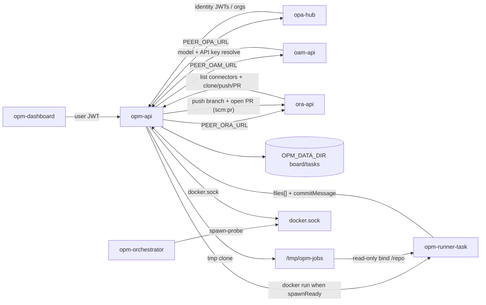

# Architecture

## Components

| Component | Image / binary | Role |
|-----------|----------------|------|
| `opm-api` | `opm-api` | HTTP control plane: GitHub-linked projects, board, tasks, roadmap, ideation, jobs |
| `opm-orchestrator` | same binary, `orchestrator` command | Spawn probe + health **only** — it schedules nothing. `main.go:103-121` registers `/api/health` and `/api/spawn-probe` and logs itself as a "job scheduler stub" (`main.go:114`); `opm-api` spawns runner containers in-process (`job_runner.go:60-91`). Shares the API image (docker CLI + sock) |
| `opm-runner-task` | ephemeral | Task-automation sandbox (one container per job phase) |
| `opm-dashboard` | separate repo | Web dashboard (Vite SPA + nginx) — browser only; talks only to `opm-api` |



## Projects = GitHub repositories

An OPM **project** is a linked GitHub repo (`owner/repo`), discovered via:

1. **OPA-Hub** — user identity (co-deployed JWTs) and organization directory (`/api/tenancy/organizations`)
2. **OAM** — connector / credential **storage** and per-agent model bindings (`PEER_OAM_URL`)
3. **ORA** — GitHub App / PAT **protocol** (list connectors/repos, clone/push/PR); `GET /api/connectors` / `…/repos`

OPM stores **references** (`connectorId`, `ownerRepo`, `organizationId`) only. It never stores GitHub App private keys or PATs.

There is **no** “add local folder” flow and no durable project root under `~/.config/opm/projects/...` as a clone. Job execution uses an **ephemeral tmp clone** (or a task-session workspace under `$OPM_JOB_TMP/tasks/...` for multi-step coding).

## Data layout

**Linked-project registry**: `$OPM_DATA_DIR/projects.json`

**Per-project board/task state** (server data dir, keyed by project id):

```text
$OPM_DATA_DIR/projects/<projectId>/
  board.json
  status.json
  changelog.md
  specs/<specId>/task.json
  specs/<specId>/implementation_plan.json
  specs/<specId>/progress.json
  specs/<specId>/spec.md
  roadmap/roadmap.json
  ideation/ideation.json
  runs/<runId>.json
```

Specs may also be committed in-repo later; OPM board state remains keyed by `owner/repo` + task id in the API store.

**Job workspaces**: `$OPM_JOB_TMP/<runId>/repo` (default `/tmp/opm-jobs/...`) — created for a run, removed afterward. Task sessions persist under `$OPM_JOB_TMP/tasks/{projectId}/{specId}/repo` through coding and review. A delivery may also use `$OPM_JOB_TMP/deliver-<uuid>/repo`.

`specs/<specId>/changes.json` is the recorded change set: the `files[]` and
`commitMessage` a runner produced, waiting to be delivered. It is written only by
a run that genuinely produced source changes, and removed once delivered.

## Code delivery chain

An implementation job and a delivery are deliberately two steps: the runner returns
a structured change set; the control plane applies it and opens a PR via ORA.

```text
run-implementation                     deliver
──────────────────                     ───────
clone repo (ORA scm:clone)             clone or reuse task workspace
mount read-only at /repo                apply changes.json
runner reads source, returns            git checkout -b opm/<specId>
  files[] + commitMessage               git add -- <applied paths only>
record specs/<specId>/changes.json      git commit
                                        push (ORA scm:pr, Contents write)
                                        open PR (ORA scm:pr)
                                        persist branch/sha/PR on the task
```

The runner never writes to the repository: `/repo` is a read-only bind, and the
runner's only output is the structured change set. Applying, committing and
pushing happen in the control plane, which is the only component that validates
paths and stages files. After automated review **PASS**, auto-deliver may run
when `OPM_IMPL_AUTO_DELIVER` is on and ORA is linked.

## Kanban columns

Ordered: `backlog` → `queue` → `in_progress` → `review` → `human_review` → `done`.

`review` is the automated review-runner column. Human approval lives in `human_review` when `humanReviewRequired` is true.

**Auto pipeline:** creating a task defaults to autopilot and enqueues `run-pipeline` (PR only after review PASS) through to `done`.

## Boundary vs Hub / OAM / ORA

| Product | Owns |
|---------|------|
| **OPA-Hub** | User JWTs, organization directory surface |
| **OAM** | Connector / AI credential storage, per-agent model bindings |
| **ORA** | Repo Watch, GitHub App/PAT protocol, code review, short-lived clone/push/PR credentials |
| **OPM** | Kanban, roadmaps, ideation, task specs/plans, task-automation jobs, delivery apply |

Dashboards never call a foreign API directly. Cross-product calls use `PEER_*_URL` + service JWTs.
